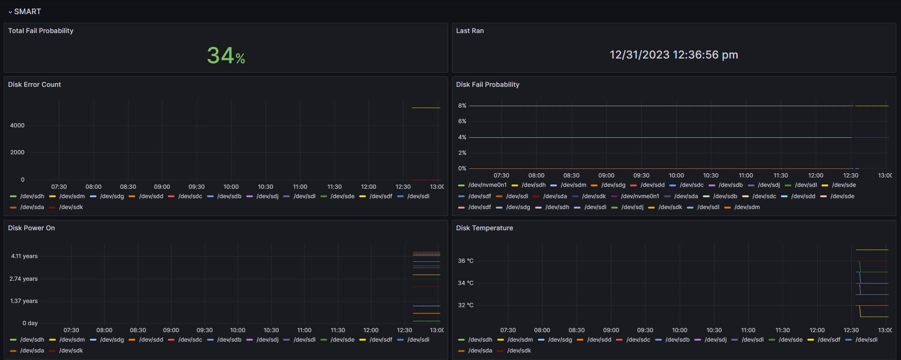

## SnapRAID Metrics Collector

SnapRAID's built-in reports are great for humans but tricky to scrape. This collector wraps the native `snapraid` CLI, parses the important bits from `smart`, `scrub`, and `sync`, and emits Prometheus-compatible metrics via the node-exporter textfile collector.

```
SnapRAID ── smart/scrub/sync ──┐
                              │ stdout + exit codes
                              ▼
                snapraid_metrics_collector.sh
                              │ Prometheus text exposition
                              ▼
             node_exporter textfile collector directory
                              │ scrape
                              ▼
                       Prometheus ➜ Grafana
```



You can find this dashboard [here](https://grafana.com/grafana/dashboards/20237-snapraid/)

### Highlights

- Opinionated CLI with per-command defaults, dry-run mode, and pluggable `snapraid` binary.
- Deterministic logging: timestamped run logs in `logs/` plus `smart.log` / `scrub.log` / `sync.log` symlinks.
- Optional live verbosity and label redaction for serial numbers/devices.
- Durable metrics buffer so failed commands still ship status/error gauges.
- Extended insight: runtime durations, byte-accurate throughput, per-operation summary counters, SMART warning totals.
- Batteries-included tooling: reproducible test fixtures, Makefile helpers, GitHub Actions CI, sample systemd unit, and container image.

---

### Quick Start

```bash
git clone https://github.com/your-org/snapraid-collector.git
cd snapraid-collector
make test                     # optional but recommended
sudo make install             # installs into /usr/local/bin by default

sudo /usr/local/bin/snapraid_metrics_collector.sh \
  --textfile /var/lib/node_exporter/textfile_collector/snapraid.prom \
  smart scrub sync
```

The script must run as root (SnapRAID requirement). Use `--dry-run` or `SNAPRAID_COLLECTOR_SKIP_ROOT=true` during local experimentation/tests to bypass the root guard.

---

### Command-Line Reference

```bash
sudo ./snapraid_metrics_collector.sh [options] command [args] [command [args] ...]
```

Commands: `smart`, `scrub`, `sync`. Arguments following a command are passed through to SnapRAID until the next command token. Use `--` in between to force literal command names into SnapRAID.

| Option | Purpose |
| ------ | ------- |
| `--textfile PATH` | Atomically write metrics to `PATH` (promotes textfile collector friendly output). |
| `--snapraid-bin PATH` | Point at an alternate `snapraid` binary (e.g. container bind mounts). |
| `--log-dir PATH` | Store logs under `PATH` (defaults to `./logs`). Symlinks `smart.log`, `scrub.log`, `sync.log` always point to the latest run. |
| `--dry-run` | Skip executing SnapRAID and still exercise parsing/metrics (disables root requirement). |
| `--verbose` | Stream SnapRAID stdout/stderr to collector stderr in real-time. |
| `--redact-identifiers` | Hash disk, serial, and device labels before exporting them as Prometheus labels. |
| `--smart-defaults "ARGS"` | Default flags prepended to `snapraid smart` invocations. |
| `--scrub-defaults "ARGS"` | Default flags prepended to `snapraid scrub`. (`-p 10` if unspecified.) |
| `--sync-defaults "ARGS"` | Default flags prepended to `snapraid sync`. |

Environment overrides:

- `SNAPRAID_BIN`, `SNAPRAID_LOG_DIR`, `SNAPRAID_SMART_DEFAULTS`, `SNAPRAID_SCRUB_DEFAULTS`, `SNAPRAID_SYNC_DEFAULTS`
- `SNAPRAID_COLLECTOR_REDACT` to force identifier masking.
- `SNAPRAID_COLLECTOR_SKIP_ROOT` for automated tests (`true`/`1`).

#### Example Invocations

```bash
# Run SMART with verbose logs redirected to stderr
sudo ./snapraid_metrics_collector.sh --verbose smart

# Custom log directory and snapraid binary
sudo ./snapraid_metrics_collector.sh \
  --log-dir /var/log/snapraid-collector \
  --snapraid-bin /opt/snapraid/bin/snapraid \
  smart sync

# Chain scrub + sync with bespoke defaults and explicit pass-through
sudo ./snapraid_metrics_collector.sh \
  --scrub-defaults "-p 20 -a" \
  --textfile /tmp/snapraid.prom \
  scrub sync -- --force-zero

# Dry-run parsing with redacted identifiers from captured output (dev only)
SNAPRAID_COLLECTOR_SKIP_ROOT=true \
./snapraid_metrics_collector.sh --dry-run --redact-identifiers smart
```

---

### Logging & Observability

- Logs live under `logs/` by default with per-run timestamps: `logs/sync-20240101T013000.log`.
- Symlinks `smart.log`, `scrub.log`, `sync.log` always target the most recent run; `logs/<command>.latest.log` mirrors the same for convenience.
- `--verbose` mirrors the exact snapshots in real time to stderr (helpful when running ad-hoc).
- Metrics are buffered before being flushed to the textfile path so even error exits export status/duration/error counters.
- Redaction hashes values deterministically (sha256 truncated to 12 chars) to preserve uniqueness without leaking serials.

---

### Metrics Overview

Common metrics emitted per command (`smart`, `scrub`, `sync`):

- `snapraid_<cmd>_exit_status` – last process exit code.
- `snapraid_<cmd>_last_ran` – millisecond epoch timestamp.
- `snapraid_<cmd>_duration_seconds` – wall-clock duration for the collector invocation.
- `snapraid_<cmd>_file_errors`, `_io_errors`, `_data_errors` – parsed from SnapRAID summaries.
- `snapraid_<cmd>_completion_percent`, `_accessed_bytes`, `_completion_duration_seconds` – normalized units, even for fractional output.
- `snapraid_<cmd>_scan_time_seconds{disk="..."}` – per disk scan timing.
- `snapraid_<cmd>_items_{updated,removed,added,copied,restored,scrubbed,verified}` – summary counters when SnapRAID prints them.

SMART-specific extras:

- `snapraid_smart_disk_temperature`, `_power_on_days`, `_error_count`, `_fail_probability` (per disk labels `disk`, `device`, `serial`, `size`).
- `snapraid_smart_total_fail_probability` – aggregate failure probability (%).
- `snapraid_smart_warning_count` – case-insensitive count of warnings/alerts in the recent output.

Scrub & sync share the access/error/summary metrics above, giving you coverage for routine health checks and heavy sync churn.

> **Tip:** Metrics are emitted even when SnapRAID returns non-zero, so alerting can fire on both `exit_status` and the underlying counters.

---

### Installation & Deployment

#### Manual Drop-In

```bash
sudo install -m 0755 snapraid_metrics_collector.sh /usr/local/bin/
sudo install -d /var/lib/node_exporter/textfile_collector
sudo /usr/local/bin/snapraid_metrics_collector.sh \
  --textfile /var/lib/node_exporter/textfile_collector/snapraid.prom \
  smart scrub sync
```

Add the command to `cron` or `systemd` timers to suit your cadence.

#### Makefile Targets

```bash
make lint        # shellcheck + shfmt (if available)
make test        # runs fixture-backed parsing tests
sudo make install
sudo make install-systemd
```

`PREFIX`/`BINDIR`/`SYSTEMD_DIR` can be overridden, e.g. `make PREFIX=/opt install`. `make uninstall` removes the installed script and sample unit.

#### Systemd Service Skeleton

The provided unit (`contrib/snapraid-metrics-collector.service`) runs the collector as a oneshot service:

```bash
sudo make install install-systemd
sudo systemctl daemon-reload
sudo systemctl enable --now snapraid-metrics-collector.service
```

Edit `/etc/systemd/system/snapraid-metrics-collector.service` (or drop an override) to customise textfile paths, add `EnvironmentFile=/etc/default/snapraid-collector`, or tweak SnapRAID arguments.

#### Docker

Build the lightweight container for cron-style runs:

```bash
docker build -t snapraid-collector .
docker run --rm \
  -v /etc/snapraid.conf:/etc/snapraid.conf:ro \
  -v /var/lib/node_exporter/textfile_collector:/exporter \
  -v /srv/snapraid-data:/srv/snapraid-data \
  snapraid-collector \
  --textfile /exporter/snapraid.prom smart scrub sync
```

Mount the host SnapRAID binary with `-v /usr/bin/snapraid:/usr/bin/snapraid:ro` if it is not already present in the image.

---

### Prometheus & Grafana Integration

Node Exporter must collect textfiles from the directory used above:

```yaml
# /etc/systemd/system/node_exporter.service (excerpt)
ExecStart=/usr/local/bin/node_exporter \
  --collector.textfile.directory=/var/lib/node_exporter/textfile_collector
```

Reload systemd (`sudo systemctl daemon-reload && sudo systemctl restart node_exporter`) after edits.

Example alerting rules:

```yaml
- name: SnapRAID Alerts
  rules:
    - alert: SnapRAIDDiskFailureProbability
      expr: snapraid_smart_disk_fail_probability > 15
      for: 5m
      labels:
        severity: warning
      annotations:
        summary: "Disk failure probability {{ $labels.disk }} is {{ $value }}%"

    - alert: SnapRAIDRunFailed
      expr: snapraid_sync_exit_status != 0
      for: 5m
      labels:
        severity: critical
      annotations:
        summary: "snapraid sync failed on {{ $labels.instance }}"
        description: "Inspect snapraid_sync_exit_status and associated logs."
```

Import the Grafana dashboard (`grafana.png`) or roll your own against the expanded metric set.

<<<<<<< HEAD
The script logs each SnapRAID command to a serperate file in the same directory a the script in `smart.log`, `scrub.log`, and `sync.log` files.
=======
---

### Development & Testing

The repository ships with canned fixtures so parsing logic stays predictable:

```bash
make test        # exercises smart/scrub/sync parsing end-to-end
make lint        # shellcheck + shfmt (no-op if tools missing)
```

- `tests/run.sh` drives the collector against `tests/bin/fake_snapraid`.
- CI (`.github/workflows/ci.yml`) installs shellcheck/shfmt and executes `make lint test`.
- Override `SNAPRAID_COLLECTOR_SKIP_ROOT=true` locally to bypass the root requirement while using fixtures.

---

### Troubleshooting

- **No metrics emitted:** confirm the textfile path is writable by root and Node Exporter points at the same directory.
- **Empty disk labels with `--redact-identifiers`:** redaction hashes only disk/device/serial values; ensure SnapRAID output includes them and that you're not redacting twice via environment overrides.
- **Large textfile diffs:** SnapRAID emits carriage returns during progress updates. The collector strips them before parsing; if you notice odd counters open an issue with sample output.
- **CI complaining about shfmt:** install `shfmt` locally or run `make lint` inside the provided container to reproduce.

---

### Roadmap / Ideas

- Native HTTP exporter mode to remove the node-exporter dependency.
- Optional persistent state cache to diff consecutive runs more efficiently.
- Alternate implementation in Go/Python for long-running daemon scenarios.

Contributions, bug reports, and sample SnapRAID outputs that break the parser are always welcome.
>>>>>>> 178acb3 (add project infrastructure: CI, Docker, Makefile, docs)
